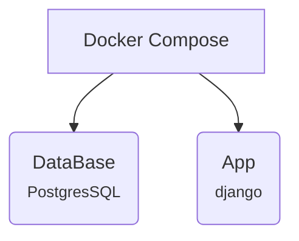

###### Database Architecture

-   We are going to use PostgresSql

*   DB with Docker compose

    -   Define with project(re-usable)
    -   persistent data using volumes
    -   Handles network configuration
    -   Environment variable configuration

-   Architecture



-   Network Connectivity

    -   This is automatically handled by docker compose

    ```yml
    services:
        app:
            depends_on:
                - DB

        db:
            image: postgres:13-alpine
    ```

    -   Set _depends_on_ on app service to start _db_ first
    -   Docker compose creates anetwork
    -   The _app_ service can use _db_ hostname

*   Volumes

    -   its how use _persistent data_ on docker compose
    -   This allow us to Maps _directory_ inside the container to _local machine_

    ```yml
    db:
        image: postgres:13-alpine
        volumes:
            - dev-db-data:/var/lib/postgresql/data

    volumes:
        dev-db-data:
        dev-static-data:
    ```
