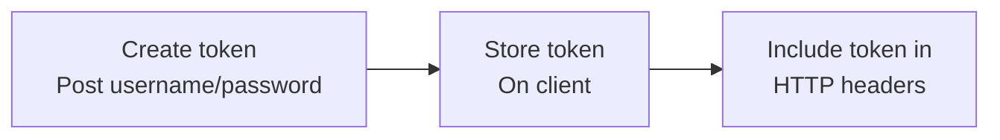

###### Authentication

-   TYpes of authentication
    -   Basic
        -   Send username and password with each request
    -   Token _(we will use it)_
        -   Use a token in the HTTP header
    -   JWT
        -   Use an access and refresh token
    -   Session
        -   Use cookies

*   Token authentication

    -   Balance of simplicity and security
    -   Support out of the box by DRF
    -   Well support by ost of the clients

*   How its works

* Pros and Cons
    * Pros Support Out of the box
    * Simple to use
    * Supported by all clients
    * Avoid sending username/password each time
* Cons
    * Token needs to be secured in client side
    * Requires database request

* Logout
    * Logout simply depend on client side

